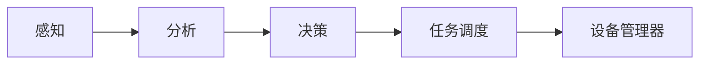

# Nexus Core（evans）

面向物理世界的智能体原型，包含：

1. **命令行**（`main.py`）：默认只跑感知→分析→决策循环（**无**三段预制场景）；`--demo` 可打开旧版演示。  
2. **智脑 Web（推荐）**：浏览器摄像头 + 文字/语音 + **Gemini 多模态**，实时（抽帧）分析画面并输出 **分析 / 推理 / 决策**。

---

## 智脑 Web（Gemini）

### 准备

1. Python 3.10+  
2. 按 [Gemini API 快速入门](https://ai.google.dev/gemini-api/docs/quickstart?hl=zh-cn) 安装 `google-genai` 并创建 API 密钥（也可在 [Google AI Studio](https://aistudio.google.com/apikey) 获取）。  
3. 项目根目录复制环境变量并填入密钥（**勿将 `.env` 提交到 Git**）：

```bash
cp .env.example .env
# 编辑 .env，推荐（与官方文档一致）：
#   GEMINI_API_KEY=你的密钥
# 亦兼容：GOOGLE_API_KEY=你的密钥
```

若你想切换模型，可在 `.env` 中设置 `GEMINI_MODEL`（例如 `gemini-3.1-flash-live-preview`）。模型不可用时会自动降级到稳定模型。

### 安装与启动

```bash
cd /path/to/evans
python3 -m venv .venv
source .venv/bin/activate   # Windows: .venv\Scripts\activate
pip install -r requirements.txt
uvicorn server:app --host 0.0.0.0 --port 8000
```

或（macOS / Linux）在项目根目录执行：`./run_web.sh`（与上面等价，**需保持该终端不关**）。

浏览器打开：**http://127.0.0.1:8000**（须使用 `http://localhost` 或 `127.0.0.1`，以便浏览器允许摄像头）。

### 前端页面在哪？

- **磁盘路径**：项目里的 `static/` 目录  
  - `static/index.html` — 页面骨架  
  - `static/app.js` — 摄像头、WebSocket、语音识别逻辑  
  - `static/style.css` — 样式  
- **访问方式**：只有**后端在跑**时，用浏览器打开 **http://127.0.0.1:8000/** 才会由 `server.py` 把 `index.html` 和 `/assets/*` 发给你；**不要**用文件管理器双击打开 `index.html`（`file://` 下摄像头和 WebSocket 常不可用）。

### 为什么「开一会就关了」？如何一直开着？

常见原因 | 处理
--------|------
**关掉了运行后端的终端** | 后端进程是 `uvicorn`，**终端一关，服务就停**。请保持该终端窗口不要关。
**误按了停止 / 进程崩溃** | 看终端里是否有报错（缺依赖、未配置 `GEMINI_API_KEY` / `GOOGLE_API_KEY` 等）。
**只想在后台长期跑** | 在终端执行（示例）：`nohup uvicorn server:app --host 0.0.0.0 --port 8000 >> server.log 2>&1 &`，或用 `tmux` / `screen` 开一个会话专门跑 uvicorn。
**页面上显示「已断开」** | 多为 **WebSocket 空闲被断开**；已在前端加入 **心跳 ping + 自动重连**。刷新页面也会重连。请确保 **8000 端口上的 uvicorn 仍在运行**。

### 使用说明

| 功能 | 说明 |
|------|------|
| 摄像头 | 点击「开启摄像头」，左侧为实时预览（仅本地显示，不上传视频流） |
| 文字 | 在文本框输入补充说明，会与**当前一帧截图**一起发给 Gemini |
| 立即分析 | 截取当前帧 JPEG，强制请求（不受默认节流限制） |
| 自动分析 | 约每 2 秒尝试一次；服务端仍有约 **1.2s** 最小间隔（可用环境变量 `ANALYZE_THROTTLE_SEC` 调整） |
| 语音 | 「开始语音识别」使用浏览器自带识别（Chrome/Edge 较佳），结果追加到文本框 |

输出区域展示：**画面分析、推理、决策与建议列表**（JSON 由模型生成，服务端解析）。

### 环境变量

| 变量 | 含义 |
|------|------|
| `GEMINI_API_KEY` | 推荐，与 [官方快速入门](https://ai.google.dev/gemini-api/docs/quickstart?hl=zh-cn) 一致 |
| `GOOGLE_API_KEY` | 可选，与上一行二选一即可 |
| `GEMINI_MODEL` | 可选，默认 `gemini-3.1-flash-live-preview`（若不可用会自动降级） |
| `ANALYZE_THROTTLE_SEC` | WebSocket 自动分析节流秒数，默认 `1.2` |
| `MAX_IMAGE_BYTES` | 单帧最大字节数，默认约 4MB |

---

## 命令行（main.py）

```bash
pip3 install -r requirements.txt
python3 main.py              # 默认：主循环 30 次，无预制剧本
python3 main.py -n 0         # 持续循环直到 Ctrl+C
python3 main.py --demo       # 旧版：三段预制场景 + 3 次主循环
```

**实时摄像头 + Gemini** 请以 Web 为准（`uvicorn server:app`）。`main.py` 内分析模块仍可能走旧 HTTP 配置，与智脑 Web 的 Gemini 是两套入口。

详见下方原项目结构说明。

## 原 CLI 功能概览

| 能力 | 说明 |
|------|------|
| **感知** | 摄像头或模拟帧 |
| **分析** | 场景理解等（可对接其他 LLM） |
| **决策** | 需求与任务规划 |
| **调度 / 设备** | Mock 机械臂、灯、窗帘等 |



## 项目结构

```
evans/
├── server.py           # 智脑 Web：FastAPI + WebSocket
├── static/             # 前端页面
├── services/
│   └── gemini_brain.py # Gemini 多模态调用
├── main.py
├── config/
├── utils/
├── core/
├── memory/
├── devices/
└── scheduler/
```

## 许可证

未随仓库提供许可证文件；使用前请自行补充或联系作者。
